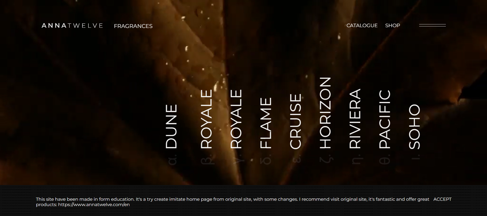

# Copy AnnaTwelve Site

This website can be viewed only on desktop, The hover animation I’ve used wouldn’t work on mobile devices.
Project was created in the form of education. This is an attempt to replicate the main "annatwelve" page with some changes.

## Tech

- JavaScript
- Css
- Html 5

[https://maciek7987.github.io/Copy-annaTwelve/]

## Some information about project

The most hardest thing was change of letters to greek in infinite during hover, where i used requestAnimationFrame and second thing was change opacity on links which weren't hover the mouse.

## Sources

link to orginal site https://www.annatwelve.com/en
